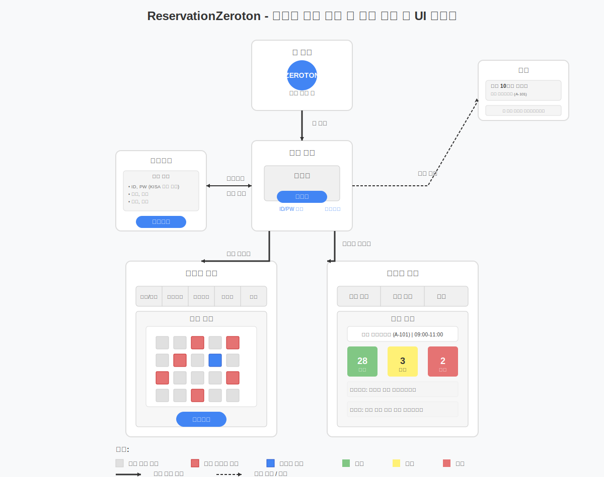

# reservation_zeroton
---------------------------------------------------------------------------
일정
---------------------------------------------------------------------------
목요일 
- 개발 시작 (파트 분담 및 개발 범위 논의)

금요일 
- 개발 중간 지점 (기본 기능 구현 및 디자인 완성)

토요일 
- 오전 (상세 기능 구현 및 디자인)
- 오후 (발표 자료 준비 및 에러 보완)

작업환경
---------------------------------------------------------------------------
메인 언어 : JAVA
프론트 : 코틀린 /
백엔드 : spring /
데이터 : sqlite

---------------------------------------------------------------------------
유저별 화면 정보
---------------------------------------------------------------------------

홈 화면 -> 로그인 화면(회원가입, ID/PW 찾기) -> (예약 및 현황, 출석 확인, 질문 입력, 사용자 정보, 알림) : 사용자 화면

-------------------------------------------------------------------------------------------------------------
홈 화면 -> 로그인 화면(회원가입, ID/PW 찾기) -> 관리자 대시보드(출석 현황, 질문 현황, 알림)             : 관리자 화면

---------------------------------------------------------------------------
구현 화면 목록
---------------------------------------------------------------------------

1. 홈 화면 > 어플 로그 및 이름
2. 회원가입 > ID, PW(KISA에 부합하는 비밀번호 형식), 학번, 이름, 학과, 학년
3. 로그인 화면 -> ID/PW
4. 출석 확인 -> 출석 / 결석
5. 예약 및 현황 -> 자리 예약 가능 / 불가능
6. 사용자 정보 -> 학번, 학과, 이름, 학년, 출석여부, 현재 자리 상태(출석, 자리비움, 결석)
7. 관리자 대시보드 -> 출석 및 질문 현황 확인 가능
8. 질문입력 -> 출석자 채팅 기능 활성화
9. 알림 -> '출석 10분전 입니다'
---------------------------------------------------------------------------
## UI 흐름도

